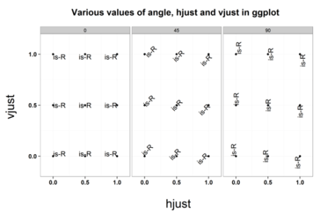

# Bar Charts with Y Values

Remember that there's a difference in how to make a bar chart with values from a variable in the data on the y-axis vice counts for a single variable.  The variable used for the y-axis should be continuous.

## Values on the Y-axis

We want to get a sense of the tone of articles associated with each Quad Class.  First we need to summarize the data to find the mean of the AvgTone variable for each QuadClass, using the *summarize* and *group_by* functions in **dplyr**.

```{r echo = FALSE, message = FALSE, warning=FALSE}
library(dplyr)
library(ggplot2)
library(scales)
subsahara_jan17 <- read.csv("subsahara_jan17.csv")
```


```{r message = FALSE, warning=FALSE, error=FALSE}
quadTone <- summarise(group_by(subsahara_jan17, QuadClass), meanTone = mean(AvgTone))

quadTone
```

To chart the new dataframe with values on the y-axis, we must add `stat = "identity"` to the *geom_bar()* function.
```{r}
ggplot(quadTone, aes(x = QuadClass, y = meanTone)) +
  geom_bar(stat = "identity", width = .5)
```

## Multiple Variables
You may want to map multiple variables to the x-axis, to create a stacked or grouped bar chart where the bars are colored based on the second variable.  In **ggplot** this is done by adding an aesthetic mapping called *fill*.

For this we will use a new data set that captures Chinese government activity in Nigeria, Zambia, and Zimbabwe in the first 2 weeks of January 2017.  If you don't have the "china_2weeks" data in your environment, then read in the CSV file.  

```{r}
china_2weeks <- read.csv("china_2weeks.csv", stringsAsFactors = FALSE)

head(china_2weeks)

str(china_2weeks)
```


When you look at the variables in the new data set, notice that the "days" variable is a Character.  This is important to be aware of because we will have to transform it into a Date later.

To compare the activity of the Chinese government across the same time period in each of the countries, use these mappings:

- Days on the x-axis.

- Number of events on the y-axis.

- Bars for each of the countries, stacked.


```{r}
ggplot(china_2weeks, aes(x = days, y = n, fill = country))+
  geom_bar(stat = "identity")
```

## Date Sequence
You can see that this chart needs some formatting to make it more readable.  

-  Adjust the labels on the x-axis.  
    - Create a sequence of dates with the *seq()* function that covers every other day in the range of dates in our data.  
    - That will make the labels easier to read.  
    - Notice the use of *as.Date()* function.
    
```{r}

dailybreaks <- seq(min(as.Date(china_2weeks$days)),
                   max(as.Date(china_2weeks$days)),
                   by="2 day")
```

- Use that sequence in a *scale_x_date()* function to set the date breaks to that sequence. 

- Use the *as.Date()* function in the aesthetics for the x-axis to make sure the data types match between the data and the scale.


```{r}
ggplot(china_2weeks, aes(x = as.Date(days), y = n, fill = country)) +
  geom_bar(stat = "identity", width = .5, color = "black") +
  scale_x_date(breaks = dailybreaks)
```


## hjust and vjust
To adjust the position, vertically and horizontally, of text you may need to use the vjust and hjust commands in conjunction with the angle command.  Note that each command can only take certain values and the combination results in different positions.

The source of the reference for this is <https://www.r-bloggers.com/hjust-and-vjust/>



-  Adjust the angle of the labels on the x-axis with another *theme()* function, including the variables:
    - `angle`
    - `hjust` (horizontal justification)
    - `vjust` (vertical justification) 
    
```{r}
ggplot(china_2weeks, aes(x = as.Date(days), y = n, fill = country)) +
  geom_bar(stat = "identity", width = .5, color = "black") +
  scale_x_date(breaks = dailybreaks) +
  theme(axis.text.x = element_text(angle = 90, hjust= .5, vjust= .5))
```


## Stacked to Grouped Bars
- Change from stacked bars to grouped bars that are side by side using `position = "dodge"` in the *geom_bar()* function.  

```{r}
ggplot(china_2weeks, aes(x = as.Date(days), y = n, fill = country)) +
  geom_bar(stat = "identity", width = .5, color = "black", position = "dodge") +
  scale_x_date(breaks = dailybreaks) +
  theme(axis.text.x = element_text(angle = 90, hjust= .5, vjust= .5))

```


## Legends
We want to make some changes to the legend on our chart.  

- The legend position is controlled by the *theme()* function:  `theme(legend.position = "bottom")`  

- Change the legend title with `labs(fill = "Country Name")`

- Change the text of the labels with `scale_fill_discrete(labels = c("Nigeria","Zambia","Zimbabwe"))`

- Remove the x-axis label and change the y-axis label.
```{r}
ggplot(china_2weeks, aes(x = as.Date(days), y = n, fill = country))+
  geom_bar(stat = "identity", position = "dodge", width = .5, color = "black")+
  scale_x_date(breaks = dailybreaks) +
  theme(axis.text.x = element_text(angle = 90, hjust= .5, vjust= .5)) +
  theme(axis.title.x = element_blank()) +
  ylab("Number of Events") +
  theme(legend.position = "bottom")+
  labs(fill = "Country Name") +
  scale_fill_discrete(labels = c("Nigeria","Zambia","Zimbabwe"))
```

## Color Palette
The colors used for each bar are based on a default color palette which can be changed.

Remember this reference: <http://www.cookbook-r.com/Graphs/Colors_(ggplot2)/>

The **RColorBrewer** package offeres pre-defined color scales. 

- Use *display.brewer.all()* to see the set of palettes.  

- To use the RColorBrewer palettes, you need to use the `scale_fill_brewer()` function as the scale for the "fill" variable, instead of `scale_fill_discrete()`.

- Include the parameters for "palette" and "labels".  

- See section 12.3 in the "R Graphics Cookbook".

Change the color palette of the bars with `scale_fill_brewer(palette = "YlOrRd", labels = c("Nigeria","Zambia","Zimbabwe"))`

```{r warning = FALSE, message=FALSE}
ggplot(china_2weeks, aes(x = as.Date(days), y = n, fill = country))+
  geom_bar(stat = "identity", position = "dodge", width = .5, color = "black")+
  scale_x_date(breaks = dailybreaks) +
  theme(axis.text.x = element_text(angle = 90, hjust= .5, vjust= .5)) +
  theme(axis.title.x = element_blank()) +
  ylab("Number of Events") +
  theme(legend.position = "bottom")+
  labs(fill = "Country Name") +
  scale_fill_brewer(palette = "YlOrRd",labels = c("Nigeria","Zambia","Zimbabwe"))
```


